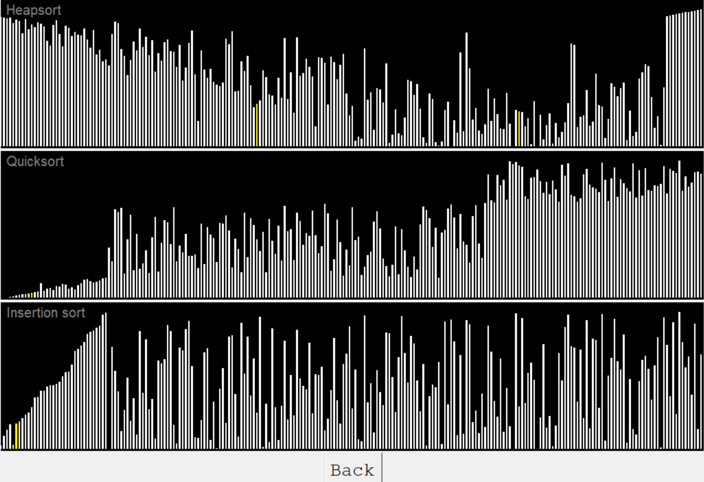

# GraphAndSortVisualisation

  
  

# Requirements
* Python 3.0.0 or newer
* tkinter

# Run
`>python main.py`

# How does it work
In the main menu, you can select which algorithms will be visualized. Then you can choose how many elements will be sorted and finally the delay between individual steps.

First, an array of the specified length is generated and shuffled. Then each algorithm is run and returns a list of steps(position swaps) to sort the array. Therefore, the visualisation does not take into account the number of comparisons that have to be made, just the number of swaps. Finally, the visualisation is run step by step.  
